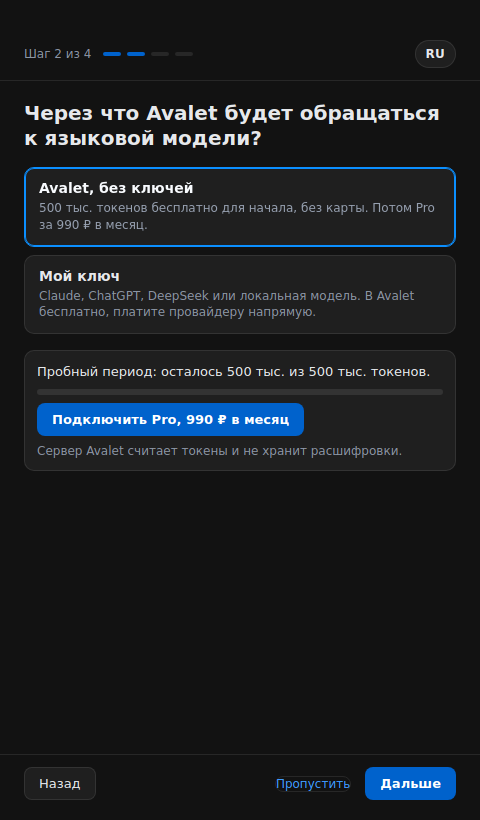
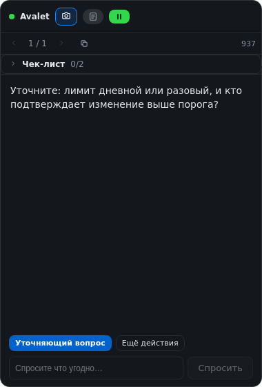

# Avalet

**Meeting assistant for systems analysts.** Avalet listens to your call (your mic and the other side's audio), transcribes it locally, and streams short, concrete suggestions into a floating overlay: what to ask next, what's missing in the requirement, a draft schema or API contract when the conversation calls for one.

Local-first: audio never leaves your Mac and transcription runs on-device. For the suggestions there are two ways to reach a language model:

- **Your own key** (free, no limits): calls go straight from the app to the provider you chose (Claude, OpenAI, DeepSeek, or a local OpenAI-compatible server). No Avalet server in between.
- **Avalet without keys**: a free trial (500,000 tokens, no card), then a monthly Pro plan. Calls go through the Avalet server, which counts tokens and does not store transcripts. *Not live yet: the server is still being built (see Known limitations).*

[Русская версия](README.ru.md)

> Status: release candidate 0.2.0-rc.1. Built by a practicing systems analyst for their own meetings first. macOS only for now.

## What it does

- **Guided first run.** Four short screens: permissions (with a live status and a "how to fix" button), access (Avalet or your own key, with a real test call), the speech model download (progress, cancel, resume), and the meeting context with a 20-second self-test that shows a real suggestion before your first call.
- **Simple by default, everything in Advanced.** The Simple level is Start/Pause, meeting type, context, transcript, summary and export. Advanced (Settings, "Advanced mode") has every provider setting, models, the live checklist, screenshot text and logs.

- **Live suggestions** as the conversation goes: clarifying questions, gaps and risks in what's being discussed, a crisp restatement of what was just said. Triggered by question/change cues in speech and by the other side pausing, not on a timer.
- **Drafts on demand.** Ask for a database schema, an ER diagram, an API contract, a process flow, and you get a concrete draft with stated assumptions, then it gets revised as new details arrive.
- **Who said what.** Your mic and the system audio are captured as two channels, so the transcript is tagged "me" / "other" and the model doesn't mistake your own words for a question addressed to you. If the other side comes out of your speakers and the mic hears it too, the duplicate is dropped.
- **Speech recognition that follows the conversation.** Audio is cut at natural pauses into whole phrases rather than fixed slices, the spoken language is fixed rather than guessed every time, and you can pick a more accurate model (small, medium, turbo) in Settings. Headphones remove the speaker echo completely.
- **Meeting context.** Paste the ticket, spec, or agenda before the call; every suggestion is grounded in it.
- **Manual ask, quick actions, screenshot.** Type a question any time, tap "Summarize" / "Risks?" / "Ask a question" / "Explain this", or send a screenshot of your screen for a priority read. Models that see images (Claude, OpenAI, DeepSeek) get the picture, which is the fast path; an optional setting adds the text recognized on your Mac for exact names, numbers and code (about a second slower). Models that do not (local ones) always get the screen as recognized text. If a provider refuses the image, Avalet retries with the text.
- **Meeting modes.** Requirements gathering, grooming and estimation, demo and acceptance, document review, interview, or free: each shifts what the assistant pays attention to.
- **Transcript and meeting summary.** Every call is saved as a meeting with a timestamped, speaker-tagged transcript. One button writes the summary in an analyst's format: decisions, open questions, requirements, risks, tasks. Export to Markdown or copy as plain text.
- **Stop / Resume / history.** Stop freezes live output without losing anything, page through earlier blocks, resume instantly. History is kept on disk.
- **Token usage you can see.** Counts come from the providers' own responses, per month and per meeting, in Settings; the overlay shows a small per-meeting number. Background work can use a cheaper model. When Avalet tokens run out, nothing breaks: the transcript keeps recording and the app offers more tokens or your own key.
- **Overlay stays out of your screen share** (macOS content protection), the way presenter notes do.
- **Works for any meeting where you have to answer fast and to the point:** requirements sessions, grooming, demos, architecture reviews, technical interviews.

## Install on macOS

Avalet is currently distributed as an unsigned build (no Apple Developer certificate yet). macOS will warn you once; the steps below get past that safely.

**Requirements:** macOS 13.2 or newer, Apple Silicon or Intel, about 1 GB free (the speech model is downloaded on first run).

1. Download the latest `Avalet-x.y.z.dmg` from [Releases](https://github.com/elsh85herz/avalet/releases).
2. Open the `.dmg` and drag **Avalet** into **Applications**.
3. Open Avalet. macOS says it "cannot be opened" or is "damaged". Close that dialog.
4. Go to **System Settings, Privacy & Security**, scroll to the bottom, click **Open Anyway** next to Avalet, confirm. (On macOS 14 and older you can instead right-click the app and choose Open.)
5. If the "damaged" message persists, run once in Terminal: `xattr -cr /Applications/Avalet.app`
6. Launch Avalet and follow the setup: allow **Microphone** and **Screen Recording** (Screen Recording is how macOS lets an app capture the other side's audio), choose your own key or Avalet, and download the speech model (about 0.5 GB, one time, from Hugging Face).
7. If the download is slow or does not start, turn on a VPN for that first download only; we use our own, [ast-net.ru](https://ast-net.ru). The model is cached afterwards and works offline. Nothing is ever downloaded without you pressing the button.
8. Click **Start** when the call begins.

Updates: the app doesn't auto-update yet. Check [Releases](https://github.com/elsh85herz/avalet/releases) for new versions; install over the old one the same way.

## Run from source

```bash
xcode-select --install            # once: compiler tools for the text recognizer
brew install node python git      # Node 20+, Python 3.11+
git clone https://github.com/elsh85herz/avalet.git
cd avalet
npm install
./scripts/setup-python.sh         # creates python-sidecar/.venv with faster-whisper
npm run dev
```

Checks (the same as CI): `npm run check` (typecheck, UI copy rules, unit and integration tests), `npm run e2e` (Electron end to end with Playwright; on Linux use `npm run e2e:xvfb`). Tests never call a real model or a real server: they use `server-mock/` and fakes in `test/fixtures/`.

In dev mode the macOS permission prompts show up under the name "Electron", not "Avalet". If you deny one by accident, enable "Electron" (or your terminal app) by hand in System Settings, Privacy & Security, Microphone and Screen Recording.

Build an installable app for yourself: `./scripts/setup-python.sh && npm run dist:mac:unsigned` (the `.dmg` lands in `release/`), or `npm run update:mac` to build and drop it straight into `/Applications`.

## How it works

```
mic (getUserMedia)                    5s WAV chunks, tagged "me"
system audio (loopback)               5s WAV chunks, tagged "other"
        |                                       |
        +----------> python-sidecar (faster-whisper, local) <----------+
                                  |
                       rolling transcript, tagged by speaker
                                  |
          question / change cues in speech, or the other side pausing
                                  |
              electron/live-session.ts -> your LLM provider (streamed)
                                  |
                 overlay window: live block, Stop / Resume, history,
                 manual ask, quick actions, screenshot
```

- **Own key: no server.** Every provider call goes from the Electron main process straight to Claude / OpenAI / DeepSeek / your local server.
- **Avalet provider:** the same OpenAI-compatible call goes to the Avalet server's proxy with a signed entitlement token instead of a key. The server meters tokens and enforces the plan; the app only shows the state. Contract: `docs/dev/billing-api.md`.
- **Providers:** `electron/providers/anthropic.ts` (native Anthropic Messages API) and `electron/providers/openai-compatible.ts` (one adapter for OpenAI, DeepSeek, and anything OpenAI-compatible such as Ollama or LM Studio via a custom base URL).
- **Keys** are entered once and stored encrypted via the OS keychain (`safeStorage`). They are never sent to the renderer.
- **Speech to text** is fully local: `faster-whisper` in `python-sidecar/server.py`, talked to over newline-delimited JSON-RPC on stdin/stdout.
- **Auto-suggest trigger:** a cheap regex over the freshly heard transcript plus a VAD-based "they stopped talking" signal from whisper's own segment timing. No extra model call.

## Screens

| First run | Simple meeting | Overlay |
|---|---|---|
|  |  |  |

All screens, both themes: [`docs/screens/`](docs/screens/README.md). They are rendered by the end-to-end tests on Linux, so the macOS translucency is missing there.

## Known limitations

- **The "Avalet without keys" option is not live yet.** The client side is done and tested against a mock server; the billing server, its signing key and the payment gateway are not deployed. Until then use your own key.
- **The live checklist is not yet verified on real meetings.** It is off in the Simple level and on in Advanced.
- **System audio capture can be fragile.** Uses [`electron-audio-loopback`](https://github.com/alectrocute/electron-audio-loopback) (MIT); needs macOS 13.2+. If the other side's audio doesn't come through, a banner shows up with a **Reconnect** button. Mic-only always works as a fallback.
- **Unsigned build.** See the install steps above. Code signing and auto-update are planned.
- **Speech model is downloaded from Hugging Face** on first run. If that's slow or blocked on your network, use a VPN for the first download (ours: [ast-net.ru](https://ast-net.ru)); the model is cached afterwards. Bundling the model with the app is on the roadmap.
- **Text recognition on screenshots is macOS only** for now (Apple Vision, works offline). Building from source needs the Xcode Command Line Tools (`xcode-select --install`); the downloadable app already includes it. On other platforms screenshots go to vision models as images only.
- **DeepSeek runs with reasoning switched off** (`thinking: disabled`): `deepseek-flash` otherwise thinks before every answer, which adds seconds. Screenshots need `deepseek-flash`; `deepseek-v4-pro` does not take images (Avalet then falls back to recognized text).
- **Logs and timings** are written to `~/Library/Logs/Avalet/avalet.log` (timings and errors only, never meeting text, screen text, or keys). Attach it when reporting slowness.
- **Consent.** Recording a call may require the other participants' consent depending on your jurisdiction. Avalet shows a visible listening indicator, but consent is on whoever runs it.

## Roadmap

- Signed builds and auto-update
- Speech model bundled with the app (no first-run download)
- Interview practice mode (the assistant asks, you answer)
- Meeting facilitation beyond the live checklist: "back on topic", open items before wrap-up
- Windows

## License

AGPL-3.0. See [LICENSE](LICENSE).

Copyright (c) 2026 Elshad Astanov.
