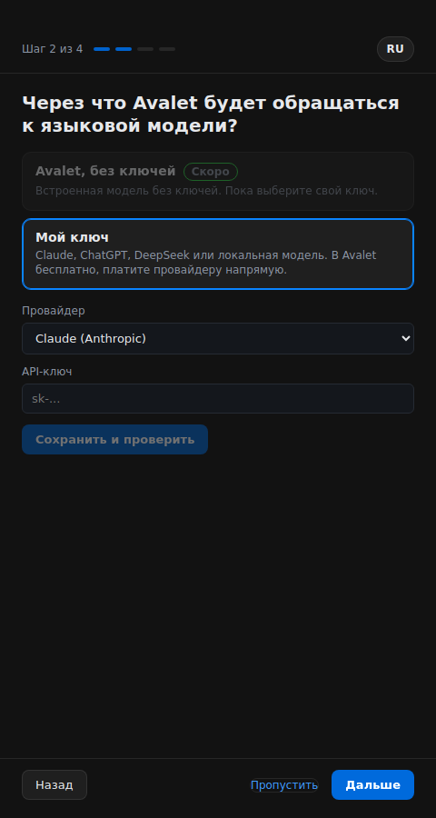
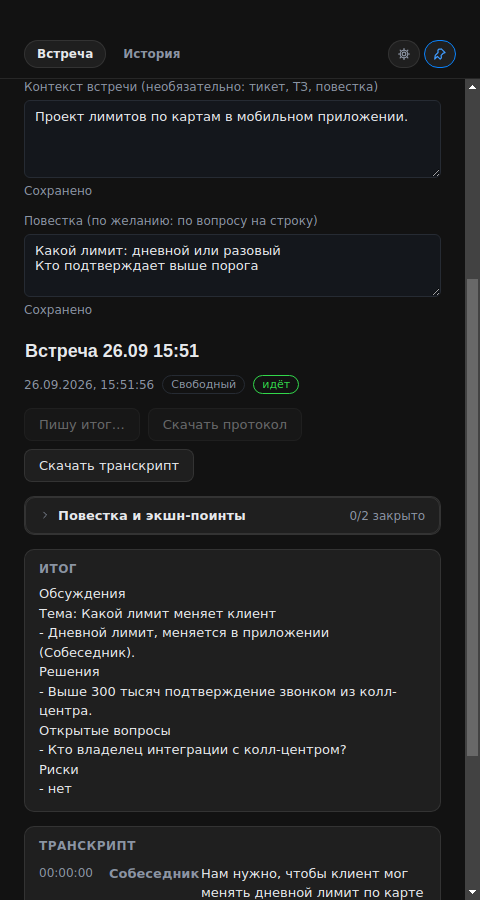
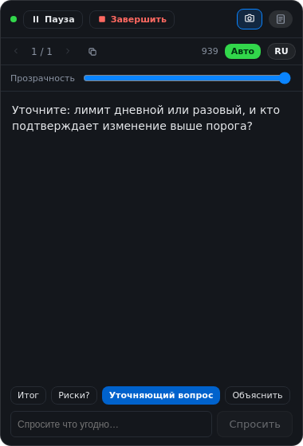

# Avalet

**Ассистент системного аналитика на встречах.** Avalet слушает созвон (ваш микрофон и звук собеседника), расшифровывает его локально и выводит в плавающий оверлей короткие подсказки по делу: что спросить дальше, чего не хватает в требовании, черновик схемы или контракта API, когда разговор к этому подошёл.

Всё на вашем Mac: звук не уходит с компьютера, распознавание речи работает локально. Для подсказок есть два способа подключить языковую модель:

- **Свой ключ** (бесплатно, без лимитов): запросы идут из приложения напрямую к выбранному провайдеру (Claude, OpenAI, DeepSeek или локальный OpenAI-совместимый сервер). Сервера Avalet посередине нет.
- **Avalet без ключей** (скоро): пробный период (500 000 токенов, без карты), потом подписка Pro на месяц. Запросы будут идти через сервер Avalet, который считает токены и не хранит расшифровки. *Пока недоступно: сервер ещё в работе, поэтому приложение показывает этот вариант как "Скоро" и работает с вашим ключом (см. "Известные ограничения").*

[English version](README.md)

> Статус: релиз-кандидат 0.2.0-rc.2. Сделано практикующим системным аналитиком в первую очередь для своих встреч. Пока только macOS.

## Что умеет

- **Первый запуск с подсказками.** Четыре коротких экрана: разрешения (с живым статусом и кнопкой "Как исправить"), доступ (свой ключ с настоящей проверкой; "Avalet без ключей" показан как "Скоро"), загрузка модели распознавания (прогресс, отмена, докачка) и контекст встречи с 20-секундной проверкой, которая показывает настоящую подсказку ещё до первого звонка.
- **Просто по умолчанию, всё остальное в расширенном режиме.** Простой режим: тот же рабочий продукт с меньшим числом настроек, а не инструментов. В главном окне Старт, Пауза, Завершить, тип встречи, контекст, расшифровка, итог и экспорт; в оверлее всё то же, что в расширенном режиме (Пауза/Продолжить, Завершить, Авто, язык, прозрачность, скриншот, конспект, все быстрые кнопки). В его Настройках доступ и проверка ключа, тип встречи и роль, все модели распознавания, папка для файлов и внешний вид, а также видно, какая модель отвечает. Расширенный режим (Настройки, "Расширенный режим") добавляет адреса провайдеров, названия моделей, фоновую модель, включение живого чек-листа, текст со скриншотов и папку логов.
- **Одна понятная проблема за раз.** На главном экране простого режима одна строка готовности (модель речи, ключ, микрофон, запись экрана) и не больше одной проблемы, самая блокирующая первой, с одной кнопкой: скачать модель, проверить ключ, открыть Системные настройки. Старт никогда не слушает без готовой модели распознавания; во время первой загрузки он ждёт и начинает встречу сам.

- **Подсказки по ходу разговора:** уточняющие вопросы, пробелы и риски в том, что обсуждается, чёткая формулировка только что сказанного. Срабатывает на вопросы и просьбы изменить в речи и на паузу собеседника, а не по таймеру.
- **Черновики по запросу.** Попросите схему базы, ER-диаграмму, контракт API, процесс, и получите конкретный черновик с озвученными допущениями, который дорабатывается по мере новых деталей.
- **Кто что сказал.** Микрофон и системный звук пишутся как два канала, транскрипт помечен "Я" / "Собеседник", модель не путает ваши слова с вопросом к вам. Если собеседник звучит из динамиков и микрофон слышит его тоже, дубль отбрасывается.
- **Распознавание речи, которое следует за разговором.** Звук режется по естественным паузам на целые фразы, а не на равные куски, язык речи задаётся, а не угадывается каждый раз, а в настройках можно выбрать более точную модель (small, medium, turbo). Наушники полностью убирают эхо от динамиков.
- **Контекст встречи.** Вставьте тикет, ТЗ или повестку до звонка, и каждая подсказка будет опираться на них.
- **Ручной вопрос, быстрые кнопки, скриншот.** Спросите что угодно в любой момент, нажмите "Итог" / "Риски?" / "Уточняющий вопрос" / "Объяснить" или отправьте скриншот экрана для приоритетного разбора. Модели с картинками (Claude, OpenAI, DeepSeek) получают изображение, это быстрый путь; по желанию в настройках можно добавить текст, распознанный на вашем Mac, для точных имён, чисел и кода (примерно на секунду медленнее). Модели без картинок (локальные) всегда видят экран как распознанный текст. Если провайдер отверг картинку, Avalet повторит запрос с текстом.
- **Режимы встречи.** Сбор требований, груминг и оценка, демо и приёмка, ревью документа, интервью или свободный: каждый смещает, на что ассистент обращает внимание.
- **Транскрипт и итог встречи.** Каждый звонок сохраняется как встреча с транскриптом по репликам, со временем и говорящим. Одна кнопка пишет итог в формате аналитика: решения, открытые вопросы, требования, риски, задачи. Экспорт в Markdown или копирование чистым текстом.
- **Пауза / Продолжить / Завершить / история.** Кнопки с подписями в оверлее и в главном окне: Пауза замораживает подсказки, ничего не теряя, старые блоки листаются, продолжить можно мгновенно; Завершить закрывает встречу и прячет оверлей. История хранится на диске.
- **Видно, сколько потрачено токенов.** Счётчики берутся из ответов самих провайдеров, за месяц и за встречу, в Настройках; в оверлее маленькое число за текущую встречу. Для фоновой работы можно поставить модель дешевле. Когда токены Avalet заканчиваются, ничего не ломается: расшифровка продолжает писаться, а приложение предлагает докупить токены или подключить свой ключ.
- **Оверлей не попадает в вашу демонстрацию экрана** (защита контента macOS), как заметки докладчика.
- **Подходит для любых встреч, где надо отвечать быстро и по делу:** сбор требований, груминг, демо, защита архитектуры, технические интервью.

## Установка на macOS

Avalet пока распространяется как неподписанная сборка (сертификата Apple Developer ещё нет). macOS один раз предупредит; шаги ниже проводят через это безопасно.

**Требования:** macOS 13.2 или новее, Apple Silicon или Intel, около 1 ГБ свободного места (модель распознавания скачивается при первом запуске).

1. Скачайте свежий `Avalet-x.y.z.dmg` из [Releases](https://github.com/elsh85herz/avalet/releases).
2. Откройте `.dmg` и перетащите **Avalet** в **Программы**.
3. Откройте Avalet. macOS скажет, что приложение "не удаётся открыть" или оно "повреждено". Закройте это окно.
4. Откройте **Системные настройки, Конфиденциальность и безопасность**, прокрутите вниз, нажмите **Всё равно открыть** напротив Avalet, подтвердите. (На macOS 14 и старше можно вместо этого нажать правой кнопкой на приложение и выбрать "Открыть".)
5. Если сообщение "повреждено" не уходит, выполните один раз в Терминале: `xattr -cr /Applications/Avalet.app`
6. Запустите Avalet и пройдите настройку: разрешите **Микрофон** и **Запись экрана** (через запись экрана macOS разрешает захват звука собеседника), введите и проверьте свой ключ и скачайте рекомендуемую модель распознавания (около 0,5 ГБ, один раз, с Hugging Face). Другие модели (medium, turbo) можно скачать, выбрать и удалить позже в Настройках, в простом и в расширенном режиме.
7. Если загрузка медленная или не идёт, включите VPN только на время этой первой загрузки. Мы пользуемся своим, [ast-net.ru](https://ast-net.ru). Дальше модель лежит в кэше и работает без интернета. Без нажатия кнопки ничего не скачивается.
8. Нажмите **Старт**, когда начнётся звонок.

Обновления: приложение пока не обновляется само. Следите за [Releases](https://github.com/elsh85herz/avalet/releases); новую версию ставьте поверх старой тем же способом.

## Запуск из исходников

```bash
xcode-select --install            # один раз: компилятор для распознавателя текста
brew install node python git      # Node 20+, Python 3.11+
git clone https://github.com/elsh85herz/avalet.git
cd avalet
npm install
./scripts/setup-python.sh         # создаёт python-sidecar/.venv с faster-whisper
npm run dev
```

Проверки (те же, что в CI): `npm run check` (типы, правила текстов интерфейса, юнит- и интеграционные тесты), `npm run e2e` (Electron целиком через Playwright; на Linux `npm run e2e:xvfb`). Тесты никогда не обращаются к настоящей модели или серверу: они используют `server-mock/` и заглушки из `test/fixtures/`.

В dev-режиме запросы разрешений macOS показываются от имени "Electron", а не "Avalet". Если случайно отказали, включите "Electron" (или ваш терминал) вручную в Системных настройках, Конфиденциальность и безопасность, Микрофон и Запись экрана.

Собрать приложение для себя: `./scripts/setup-python.sh && npm run dist:mac:unsigned` (`.dmg` появится в `release/`), или `npm run update:mac`, чтобы собрать и сразу положить в `/Applications`.

## Как это работает

```
микрофон (getUserMedia)               WAV-чанки по 5 с, метка "Я"
системный звук (loopback)             WAV-чанки по 5 с, метка "Собеседник"
        |                                       |
        +----------> python-sidecar (faster-whisper, локально) <-------+
                                  |
                   скользящий транскрипт с метками говорящих
                                  |
     вопрос или просьба изменить в речи, либо пауза собеседника
                                  |
            electron/live-session.ts -> ваш LLM-провайдер (стриминг)
                                  |
              оверлей: живой блок, Пауза / Продолжить, Завершить, история,
              ручной вопрос, быстрые кнопки, скриншот
```

- **Свой ключ: без сервера.** Каждый запрос к модели идёт из main-процесса Electron напрямую в Claude / OpenAI / DeepSeek / ваш локальный сервер.
- **Провайдер Avalet:** тот же OpenAI-совместимый запрос идёт в прокси сервера Avalet с подписанным токеном доступа вместо ключа. Сервер считает токены и следит за тарифом; приложение только показывает состояние. Контракт: `docs/dev/billing-api.md`.
- **Провайдеры:** `electron/providers/anthropic.ts` (нативный Anthropic Messages API) и `electron/providers/openai-compatible.ts` (один адаптер для OpenAI, DeepSeek и всего OpenAI-совместимого, например Ollama или LM Studio, через свой base URL).
- **Ключи** вводятся один раз и хранятся зашифрованными через связку ключей ОС (`safeStorage`). В renderer они не попадают.
- **Распознавание речи** полностью локальное: `faster-whisper` в `python-sidecar/server.py`, общение по JSON-RPC через stdin/stdout.
- **Триггер авто-подсказок:** дешёвая регулярка по свежему транскрипту плюс сигнал "собеседник замолчал" из таймингов сегментов whisper. Без лишнего вызова модели.

## Экраны

| Первый запуск | Встреча в простом режиме | Оверлей |
|---|---|---|
|  |  |  |

Все экраны в обеих темах: [`docs/screens/`](docs/screens/README.md). Их снимают сквозные тесты на Linux, поэтому полупрозрачности macOS там нет.

## Известные ограничения

- **Вариант "Avalet без ключей" пока не запущен.** Клиентская часть готова и проверена на тестовом сервере; сервер оплаты, его ключ подписи и платёжный шлюз ещё не развёрнуты. До тех пор приложение показывает этот вариант как "Скоро", не обращается к серверу оплаты и работает с вашим ключом.
- **Живой чек-лист ещё не проверен на реальных встречах.** В простом режиме он выключен, в расширенном включён.
- **Захват системного звука бывает хрупким.** Используется [`electron-audio-loopback`](https://github.com/alectrocute/electron-audio-loopback) (MIT); нужна macOS 13.2+. Если звук собеседника не идёт, появится баннер с кнопкой **Переподключить**. Только микрофон работает всегда.
- **Неподписанная сборка.** См. шаги установки выше. Подпись и автообновление в планах.
- **Модель распознавания скачивается с Hugging Face** при первом запуске. Если из вашей сети это медленно или недоступно, включите VPN на время первой загрузки (наш: [ast-net.ru](https://ast-net.ru)); дальше модель лежит в кэше. Модель внутри приложения в планах.
- **Распознавание текста на скриншотах пока только macOS** (Apple Vision, работает офлайн). Для сборки из исходников нужны Xcode Command Line Tools (`xcode-select --install`); в скачанное приложение оно уже входит. На других платформах скриншоты уходят в модели с картинками только изображением.
- **DeepSeek работает с выключенным размышлением** (`thinking: disabled`): иначе `deepseek-flash` думает перед каждым ответом, и это добавляет секунды. Для скриншотов нужна `deepseek-flash`; `deepseek-v4-pro` картинки не принимает (тогда Avalet переключится на распознанный текст).
- **Логи и замеры времени** пишутся в `~/Library/Logs/Avalet/avalet.log` (только время и ошибки, без текста встреч, экрана и ключей; всё похожее на ключ вырезается, а повторяющееся предупреждение пишется раз в десять минут). Приложите его, когда пишете о медленной работе.
- **Согласие на запись.** Запись разговора может требовать согласия участников в зависимости от юрисдикции. Avalet показывает индикатор прослушивания, но согласие остаётся на том, кто им пользуется.

## Планы

- Подписанные сборки и автообновление
- Модель распознавания внутри приложения (без скачивания при первом запуске)
- Режим репетиции интервью (ассистент спрашивает, вы отвечаете)
- Фасилитация встреч сверх живого чек-листа: "вернуться к теме", незакрытые вопросы перед завершением
- Windows

## Лицензия

AGPL-3.0. См. [LICENSE](LICENSE).

Copyright (c) 2026 Эльшад Астанов.
